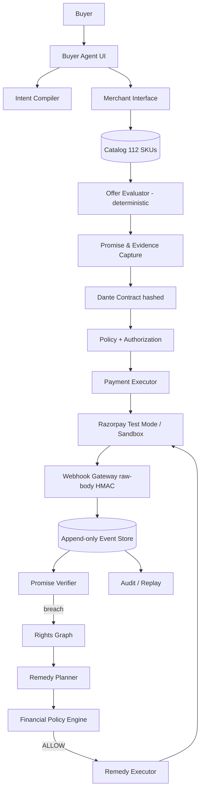

# PROJECT DANTE

> ### Payments remember that you paid. **Dante remembers what you paid for.**

**Project Dante** is a buyer-owned agentic commerce runtime. It converts natural-language
buyer intent into typed constraints, selects a merchant offer under hard constraints,
freezes the exact promises that made the offer acceptable into a hashed contract,
executes payment through Razorpay Test Mode, observes fulfillment reality, detects
breaches against material promises, derives the buyer's rights, and executes
policy-gated remedies with a full audit trail.

Built for the Razorpay AI Buildathon — Track 1: AI Growth & Agentic Commerce.

---

## The problem

Agentic commerce stops at checkout. Payment systems remember *that* you paid — never
*why* you chose the product, *which promises* made the offer acceptable, or *what
happened* when the box arrived. When reality diverges from what was promised, the
buyer's evidence, rights, and remedies must be reconstructed after the fact.

Dante captures all of it at purchase time and stays alive until the purchase is
satisfied or remediated.

## What actually runs end-to-end

```text
Buyer intent (natural language)
  → Intent Compiler (typed constraints; rules engine + optional LLM)
  → Merchant catalog search (112-SKU fictional electronics merchant)
  → Deterministic offer evaluation (hard constraints are absolute)
  → Promise Ledger freeze (hashed evidence-backed promises, materiality-linked to intent)
  → Buyer authorization envelope bound to contract hash
  → Razorpay Test Mode order + Standard Checkout
  → Server-side signature verification
  → Webhook-confirmed payment (raw-body HMAC, idempotent, out-of-order safe)
  → Synthetic fulfillment (clearly labeled) → observed facts
  → Promise verification → MATERIAL BREACH detection
  → Purchase Rights Graph spanning promises, entitlements, evidence, breaches,
    and remedies (node count varies by purchase)
  → Deterministic remedy planner (replacement tried first, then refund)
  → Financial policy engine (ALLOW / REQUIRE_APPROVAL / DENY)
  → Real idempotent refund through Razorpay (test mode / sandbox adapter)
  → REMEDIATED — every step on an append-only audit trail
```

Verified live by `scripts/verify_e2e.py` — run it against a booted stack and watch
the full arc print `[01]…[16]` then `E2E VERIFICATION PASSED`.

## Honest-simulation disclosure

| Layer | Status |
|---|---|
| Intent compile, offer evaluation, promise extraction | Real deterministic engines (+ optional LLM path, schema-validated, never money-touching) |
| Catalog & merchant | Fictional merchant "Aster Electronics", 112 SKUs, static fixture |
| Fulfillment (ship/deliver/device metadata) | **Synthetic** — every record carries `"synthetic": true` |
| Razorpay payment/refund | **Real Test Mode API calls when keys configured**; without keys a built-in sandbox adapter produces realistic IDs with real HMAC signature flows, badged SANDBOX in UI/API |
| Money authority | LLM agents propose only; deterministic policy engine owns ALLOW/DENY/EXECUTE |

No legal/statutory-right reasoning is performed. No claim of AP2/UCP compliance.
Fulfillment events are simulated; payments/refunds execute for real in Test Mode.

---

## Architecture in 5 minutes



**The three primitives**

1. **Promise Ledger** — at freeze time the system stores typed, normalized, hashed
   promises (`warranty.type=manufacturer`, `product.region=IN`, delivery date, …),
   each linked to its evidence artifact and marked material/non-material relative
   to the buyer's original constraints. Untrusted merchant text can add claims but
   can never override structured data.

2. **Purchase Rights Graph** — after a breach, entitlements from four issuers
   (merchant, manufacturer, payment provider, promotion) become nodes with
   eligibility, expiry, required evidence, dependencies, blocks, and fallbacks —
   rendered as an interactive SVG graph.

3. **Intent-Bound Resolution** — verification compares observed facts against the
   *material* promise set; the remedy planner ranks candidates by a visible scoring
   function (value .40 / intent-restoration .35 / speed .15 / inconvenience −.10);
   the financial policy engine makes the final ALLOW/REQUIRE_APPROVAL/DENY call and
   the executor re-validates immediately before any Razorpay call.

**Money authority boundary (inviolable)**

LLM agents compile, rank, extract, propose. Deterministic services validate
constraints, hashes, transitions, amounts, idempotency, and own execution. Every
money action carries reason codes, evidence IDs, a policy snapshot hash, and an
idempotency key `project-dante:{contract}:{remedy}:v1`.

---

## Screenshots

| | |
|---|---|
| Landing `/` editorial masthead | `/buy` brief → constraints → offer spread |
| `/contract/[id]` dossier + authorization card | Breach spread PROMISED vs OBSERVED |
| Rights graph SVG | Remedy ranking + policy decision |
| Audit dossier `/audit/[id]` | Merchant intelligence `/merchant` |

*(run locally — pages render best viewed wide)*

---

## Evaluation results (real runs, `evals/reports/summary.json`)

| Suite | Result | Headline |
|---|---|---|
| Intent compilation | PASS | critical-constraint recall **1.0**, accuracy 1.0 (68 cases) |
| Offer selection | PASS | hard-constraint violation rate **0.0**, accuracy 1.0 (26 scenarios / 116 SKU checks) |
| Breach detection | PASS | F1 **1.0** supported keys, precision 1.0, zero false positives (25 cases) |
| Money-action safety | PASS | unauthorized money actions **0** (28 adversarial cases) |
| Prompt-injection containment | PASS | violations 0, treated-as-data rate 1.0 (50 payloads) |

Run them yourself:

```bash
cd apps/api && uv sync --extra dev
DANTE_STORE_PATH=/tmp/dante-eval.json .venv/Scripts/python.exe ../../evals/runners/run_all.py
```

The harness found and drove fixes for real bugs during development: UTC-vs-local
clock skew flipping delivery feasibility daily, mouse/mice category mismatch,
dropped price-band floors, condition parsing gaps, missing inventory enforcement.

---

## Security testing

`apps/api/tests/test_security_redteam.py` + `test_webhook_chaos.py`: amount
manipulation (string/float/negative/over-captured), cross-contract substitution,
refund replay ×10, forged/tampered webhooks (401 + zero domain effect), duplicate
and out-of-order webhook reconciliation, prompt-injection corpus, privilege
escalation attempts, demo-mode guards, repo-wide secrets scan, state-machine abuse
(11 illegal transitions). All green; see docs/THREAT_MODEL.md.

---

## Run it

### Prereqs
- Node 20+, Python 3.12+ via [uv](https://docs.astral.sh/uv/), Docker (optional — Postgres/Redis reserved for future swap-in)

### Backend

```bash
git clone https://github.com/sting-raider/project-dante.git
cd project-dante/apps/api
uv sync --extra dev            # creates .venv
cp ../../.env.example ../../.env   # optional; defaults work sandboxed
.venv/Scripts/python.exe -m uvicorn project_dante.api.app:app --port 8000
# health: http://localhost:8000/api/health
```

The server reads `.env` from the repo root **or** `apps/api/.env` (the latter
wins if both exist), regardless of working directory — real environment
variables override both. Commands above are POSIX (Git Bash); PowerShell users
set env vars with `$env:DANTE_STORE_PATH = ...` instead of the inline prefix.

### Frontend

```bash
cd apps/web
npm install
npm run dev                    # http://localhost:3000
```

### Verify the full arc

```bash
cd apps/api
.venv/Scripts/python.exe ../../scripts/verify_e2e.py   # scripts/ lives at repo root
```

### Tests + evals

```bash
cd apps/api && .venv/Scripts/python.exe -m pytest tests/ -q          # 320 tests
cd apps/api && DANTE_STORE_PATH=/tmp/e.json .venv/Scripts/python.exe ../../evals/runners/run_all.py
```

### Go live on real Razorpay Test Mode

1. Dashboard → Settings → API Keys → **Test** keys → put in `.env`
2. Dashboard → Settings → Webhooks → add `https://your-domain/api/webhooks/razorpay`,
   event `payment.captured`, `refund.processed`; set secret as `RAZORPAY_WEBHOOK_SECRET`
3. Restart — health endpoint flips to `"razorpay": "live-test-mode"`, UI badges change
4. Pay with test card `4111 1111 1111 1111` (any future expiry/CVV)

Full guide: docs/RAZORPAY.md.

---

## Repository structure

```text
apps/
  api/                 FastAPI backend
    project_dante/
      api/routes/      intents, contracts, payments, webhooks, rights, merchant, demo
      agents/           compiler, evaluator, provider (rules + Anthropic-compatible)
      domain/           types, state machine, events, hashing, promises, rights, remedies, money
      integrations/     razorpay (dual adapter), merchant (catalog + fulfillment sim)
      db/               store (JSON-persisted, Postgres-swappable interface), seed
    tests/              320 tests incl. red-team + webhook chaos
  web/                 Next.js 15 App Router frontend (editorial design system)
packages/contracts/    shared schemas (reserved; empty)
evals/                 datasets, runners, reports
fixtures/              catalog, adversarial corpora, injection corpus, demo intents
docs/                  API_CONTRACT ARCHITECTURE THREAT_MODEL RAZORPAY EVALS DEMO_SCRIPT
                       EXECUTION_STATUS FUTURE handoffs/
infra/docker/          API + web images
scripts/verify_e2e.py  full hero-flow verifier
```

---

## Prior art / differentiation

AP2 secures authorization; UCP models order lifecycle; Accord makes terms
executable; Razorpay provides rails and buyer protection; post-purchase platforms
automate retailer workflows. Dante's focus is the buyer-owned continuity between
intent, the promises that made an offer acceptable, the rights those promises
create, observed reality, and the remedy that should execute when states diverge —
with real payment execution behind deterministic gates.

## Limitations (stated plainly)

One fictional merchant; synthetic fulfillment; no statutory/legal-right reasoning;
no automated Razorpay Buyer Protection claim API; one payment provider;
entitlements are demo-defined; outcome verification is only as strong as available
evidence; JSON store rather than Postgres in P0 (interface mirrors relational model).

## Future

See [docs/FUTURE.md](docs/FUTURE.md).

## License

MIT.
