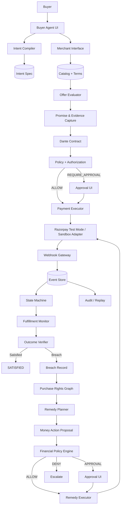

# Project Dante — Architecture

> Status: living document, updated at each integration wave.
> Master plan: `PROJECT_DANTE_RAZORPAY_BUILDATHON_MASTER_PLAN.md` §10–§25.

## One-line thesis

**Payments remember that you paid. Dante remembers what you paid for.**

Dante is a buyer-owned agentic commerce runtime: it converts natural-language buyer
intent into typed constraints, selects a merchant offer under hard constraints,
freezes the exact promises that made the offer acceptable into a hashed contract,
executes payment through Razorpay Test Mode, observes fulfillment reality,
detects breaches against material promises, derives the buyer's rights,
and executes policy-gated remedies (refunds) with a full audit trail.

## System diagram

## Money authority boundary (inviolable)

1. LLM agents compile intent, rank offers, extract candidate promises, propose remedies.
2. Deterministic services validate constraints, evidence, state transitions, policy,
   idempotency, and exact amounts.
3. **No LLM ever holds Razorpay credentials or executes a money action.**
4. Every money action: typed proposal → deterministic policy → executor re-check → call.
5. Final truth of payment state = webhook signature verification server-side.

## Module map

| Layer | Path | Owner |
|---|---|---|
| Domain types | `apps/api/project_dante/domain/types.py` | Lead (frozen) |
| State machine | `domain/state_machine.py` | Lead (frozen) |
| Event vocabulary | `domain/events.py` | Lead |
| Hashing | `domain/hashing.py` | Lead |
| Store | `db/store.py` | Lead |
| Razorpay adapters | `integrations/razorpay/*` | Agent B |
| Agent runtime | `agents/*` | Agent C |
| Promise pipeline | `domain/promises/*` | Agent D |
| Rights/remedies/policy | `domain/rights`, `domain/remedies`, `domain/money` | Agent E |
| Merchant interface | `integrations/merchant/*`, fixtures | Agent F |
| Routes | `api/routes/*.py` | B/C/D/E/F respectively |

## Honest-simulation labels

- Fulfillment (shipping/delivery/device metadata): **synthetic** (`"synthetic": true`).
- Razorpay without keys configured: built-in **sandbox adapter** producing realistic IDs
  and real HMAC signature flows, badged SANDBOX everywhere.
- With test keys set: every order/payment/refund is a **real Razorpay Test Mode call**.
